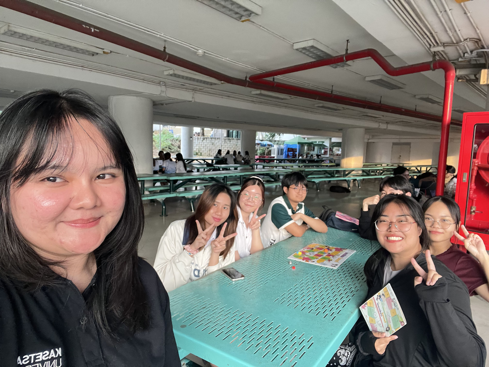
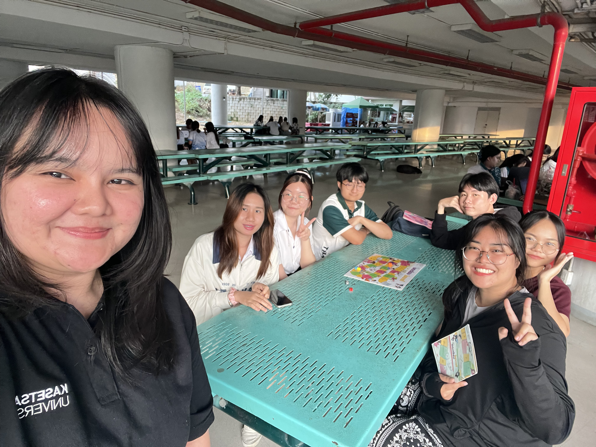

# 👮🏻‍♂️ Securing the Human
> Cybersecurity is not just about systems and technology — it's about people. Train the human, secure the system.

# 🐩 NCSA Boardgame Challenge with Manoi Group

กลุ่มนิสิตจากสาขาวิชาวิทยาการคอมพิวเตอร์ภายใต้ชื่อ **“Manoi”** ได้จัดกิจกรรมเพื่อสร้างความตระหนักรู้บนโลกไซเบอร์เมื่อวันที่ 24 มกราคม 2568 เวลา 17:00น. ณ ตึก17 มหาวิทยาลัยเกษตรศาสตร์ วิทยาเขตศรีราชา ให้กับนิสิตคณะวิทยาการจัดการ สาขาการบัญชี โดยใช้บอร์ดเกมที่พัฒนาโดยสำนักงานคณะกรรมการการรักษาความมั่นคงปลอดภัยไซเบอร์แห่งชาติ (สกมช.) หรือ NCSA ซึ่งมีผู้เข้าร่วมกิจกรรมจำนวนทั้งหมด 6 คน เป็นนิสิตสาขาการบัญชี 2 คน และตัวแทนจากสมาชิกกลุ่มผู้จัดทำอีก 4 คน

กิจกรรมในครั้งนี้ได้มีการแลกเปลี่ยนแนวคิดและแนวปฏิบัติที่เกี่ยวข้องกับความมั่นคงปลอดภัยไซเบอร์กับผู้เข้าร่วมกิจกรรม ซึ่งส่งผลให้สร้างความตระหนักรู้เกี่ยวกับสิ่งที่ปลอดภัยหรือไม่ปลอดภัยบนโลกไซเบอร์ได้อย่างดีและมีประสิทธิภาพ 

# 📷 ภาพบรรยากาศ
ภาพบรรยากาศ 1            |  ภาพบรรยากาศ 2
:-------------------------:|:-------------------------:
 |  

ภาพบรรยากาศ 3            |  ภาพบรรยากาศ 4
:-------------------------:|:-------------------------:
 |  

# 📹 VDO

> ทั้งนี้ทางกลุ่มผู้จัดได้ขออนุญาตผู้เข้าร่วมถ่ายภาพและวิดีโอเพื่อบันทึกภาพกิจกรรมดังกล่าวเรียบร้อยแล้ว

# 👨🏻‍💻 สมาชิก
1. [Chonnikarn Sangwang](https://nixe97.github.io/boardgame) 
2. [Natnicha Nontraudon]
3. [Supawadee Muangprasert]
4. [Jakapob Siwakulrangsun]
5. [Tanatorn Jitsatsawan]
