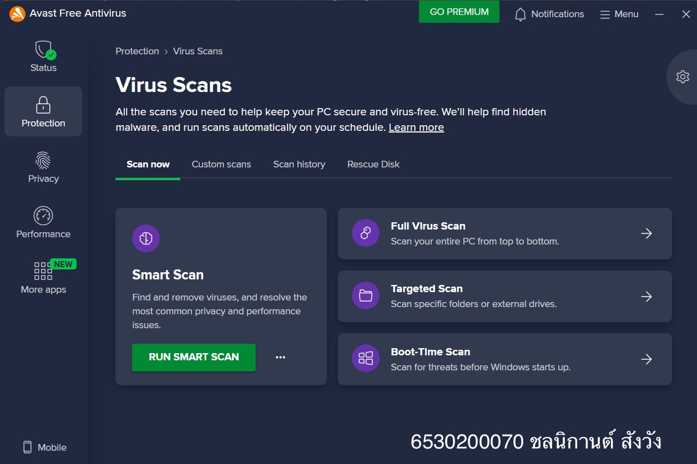

# 🔐 **Security Control**  

### 📷 **ภาพประกอบ:**  

## 👮🏻‍♂️ **Type of Security Controls**  

> **Avast Antivirus** ถือเป็น **Technical security control** เนื่องจากช่วยตรวจจับ ป้องกัน และตอบสนองต่อภัยคุกคามด้านความปลอดภัย เช่น ไวรัส มัลแวร์ และการโจมตีแบบฟิชชิ่ง

| **Control Functions**   | **รายละเอียด**                                                                                                                                           |
|:---------------------------|:---------------------------------------------------------------------------------------------------------------------------------------------------------|
| ✅ **Preventive Control**        | 👉 **ป้องกันมัลแวร์ไม่ให้เข้าสู่ระบบตั้งแต่แรก** เพราะมี **Real-time Protection** และ **Web Shield** ที่ช่วยบล็อกเว็บไซต์อันตรายและไฟล์ที่อาจเป็นภัยก่อนที่ผู้ใช้จะเปิด |
| ✅ **Detective Control**        | 👉 **ตรวจจับภัยคุกคามที่อาจหลุดเข้ามาในระบบ** เพราะมี **Smart Scan** ที่ค้นหาไวรัส สปายแวร์ และซอฟต์แวร์ที่เป็นอันตรายที่อาจติดอยู่แล้วได้ |
| ✅ **Corrective Control**        | 👉 **กำจัดและกู้คืนระบบหลังจากถูกโจมตี** เพราะสามารถลบไฟล์อันตราย หรือกักกันไม่ให้แพร่กระจายได้ นอกจากนี้บางเวอร์ชั่นยังมี **Rescue Disk** ที่สามารถช่วยกู้คืนระบบหลังจากถูกโจมตีรุนแรงอีกด้วย  |
